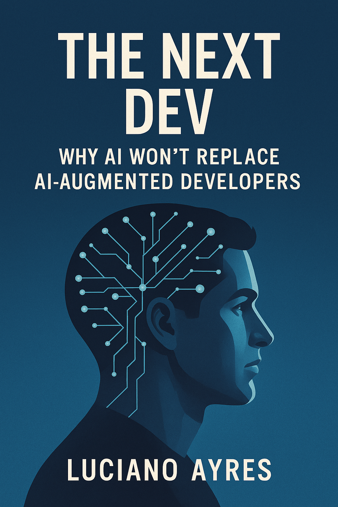

# The Next Dev: Why AI Won’t Replace AI‑Augmented Developers

**[The Next Dev: Why AI Won’t Replace AI‑Augmented Developers](./The_Next_Dev_Why_AI_Wont_Replace_AI-Augmented_Developers_Book.md)**  
_AI-Powered Augmentation for Software Developers: How AI Will Amplify, Not Replace, Human Creativity and Expertise_

By **[Luciano Ayres](https://www.linkedin.com/in/lucianoayres/)**

**First Edition | Published April 12, 2025**  
**Version 1.0**

---

## About the Book 📖

_The Next Dev: Why AI Won’t Replace AI‑Augmented Developers_ is a comprehensive book designed for CTOs, engineering leaders, and senior developers. This guide explores how AI assistance is not a threat but a strategic enabler that amplifies deep technical expertise, fosters human creativity, and transforms software development processes. It presents actionable insights and research‑driven arguments that demonstrate how AI‑augmented developers outperform traditional models by merging the art of coding with cutting‑edge automation.

Topics include:

- The emerging paradigm of AI‑augmented development
- Deep technical expertise combined with extensive practice using AI‑assisted coding tools
- Enhancing creativity, judgment, and productivity with AI support
- Real‑world workflows demonstrating faster delivery and superior quality
- Future trends and strategic implications for leading technology teams

---

## How to Read the Book 📚

Read the complete book for free by clicking the link below:

[Read the Book (Markdown)](./The_Next_Dev_Why_AI_Wont_Replace_AI-Augmented_Developers_by_Luciano_Ayres.md)

Prefer a PDF version? Download it here:

[Download PDF](./pdf/The_Next_Dev_Why_AI_Wont_Replace_AI-Augmented_Developers_by_Luciano_Ayres.pdf)

Or choose the Epub version:

[Download Epub](./epub/The_Next_Dev_Why_AI_Wont_Replace_AI-Augmented_Developers_by_Luciano_Ayres.epub)

---

## Table of Contents 📝

1. [Introduction](./The_Next_Dev_Why_AI_Wont_Replace_AI-Augmented_Developers_Book.md#1-introduction)

   - Overview of AI’s impact on software development
   - The emergence of AI‑augmented developers
   - The central thesis: AI extends, not replaces, human developers
   - Defining the AI‑augmented developer and the human–AI partnership

2. [Deep Technical Expertise and Extended Capabilities](./The_Next_Dev_Why_AI_Wont_Replace_AI-Augmented_Developers_Book.md#2-deep-technical-expertise-and-extended-capabilities)

   - The importance of deep technical expertise in modern development
   - Mastering AI‑assisted coding tools (e.g., Agent AI‑enabled IDEs)
   - The role of extensive practice and experience in achieving AI‑augmented proficiency
   - Synergy between human judgment and AI speed
   - Addressing misconceptions: AI is not a silver bullet

3. [Human Creativity, Judgment, and AI‑Enhanced Intelligence](./The_Next_Dev_Why_AI_Wont_Replace_AI-Augmented_Developers_Book.md#3-human-creativity-judgment-and-ai-enhanced-intelligence)

   - The role of human creativity in designing solutions
   - How AI expands cognitive bandwidth without replacing human intuition
   - Evaluating AI‑generated ideas using human judgment
   - Balancing creativity, context, and automated assistance
   - Maintaining focus and “flow” with AI support

4. [The AI‑Augmented Development Process](./The_Next_Dev_Why_AI_Wont_Replace_AI-Augmented_Developers_Book.md#4-the-ai-augmented-development-process)

   - Detailed overview of real‑world AI‑augmented workflows
   - Stages: Planning & Design, Coding & Implementation, Testing & Verification
   - Integrating AI in code review, deployment, operations, and maintenance
   - The benefits: faster delivery, improved quality, and continuous improvement
   - Case study: Building a fraud detection module with AI augmentation

5. [Enhanced Quality, User Experience, and Professional Outcomes](./The_Next_Dev_Why_AI_Wont_Replace_AI-Augmented_Developers_Book.md#5-enhanced-quality-user-experience-and-professional-outcomes)

   - Improving code quality and maintainability with AI
   - Accelerating feature delivery and enhancing user experience (UX)
   - Boosting team productivity and professional growth
   - Balancing AI automation with human oversight
   - Attracting talent and staying competitive

6. [Conclusion and Future Outlook](./The_Next_Dev_Why_AI_Wont_Replace_AI-Augmented_Developers_Book.md#6-conclusion-and-future-outlook)

   - Summarizing the benefits of AI‑augmented development
   - The evolving role of developers in an AI‑powered future
   - Future trends: More powerful AI tools and new specialized roles
   - Adopting an AI‑growth mindset
   - Final thoughts on integrating AI with human creativity

7. [References](./The_Next_Dev_Why_AI_Wont_Replace_AI-Augmented_Developers_Book.md#7-references)

---

## Contributing & Feedback 🤝

Your feedback is highly appreciated! If you have suggestions, corrections, or improvements, please feel free to submit an issue or open a pull request. Contributions that help improve this book are welcome.

---

## License 📄

This work is licensed under the [Creative Commons Attribution-ShareAlike 4.0 International License](https://creativecommons.org/licenses/by-sa/4.0/).
